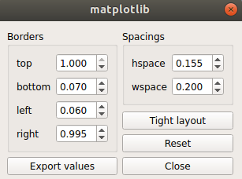

# Matplotlib

## For the impatients

* Extract the `latin-modern-font-family.zip` and copy the fonts inside `~/.fonts/`
* Clear the matplotlib cache
* Use font family `Latin Modern Roman` inside matplotlib plots.
* Use `usetex=False` for intial plots.
* If there is some issue with latex symbols or you want to write some equations you `usetex=True`.
* Some examples are included in the scripts

## Installing fonts
You may want to use a custom font like `Latin Modern Roman` or `Helvetica` in matplotlib or anywhere in the system. Matplotlib can use any font installed in the system. To install a font in proceed as follows
### Linux

Just copy the fonts to `~/.fonts/` directory
```bash
mkdir ~/.fonts
cp fontname ~/.fonts
```

After installing and clearing matplotlib cache. matplotlib will recognise the new fonts installed.

## Latex Style Plotting

You have to enclose the latex expression inside `r"$latex_expression_here$"` to render them inside latex plot.
To render latex text in your plot you have two choices 

* `LaTex` : `usetex=True` Slow but complete latex feature
* `MathText` : `usetex=False` Way faster (*Recommended for most of the plots*)

### LaTex
If you want to not care about fonts and just directly use latex for all of your figure the `use_tex=True`. But this is very slow.

*You will need a working `texlive` installation for this to work.*

### MathText

Best choice is to use `Latin Modern Fonts` which are provided in this repo, for regular text and use mathtext for rendering latex style symbols. This is way faster than proper latex render but do not have complete latex functionality.

Latin modern fonts are implementation fo computer modern fonts that latex uses but may be more optimized version we can say. The Latin Modern Fonts are included in the zip file in this repo. To get the most updated version of these fonts you can go to https://www.gust.org.pl/projects/e-foundry/latin-modern/download. Once you have installed them in your system you need to clearn the mathplotlib cache so that matplotlib can rebuild the font cache.


So the best practive would be to plot all figures with latin modern font and then in the very final step use latex style rendering(if you really really need) to publish.

## Clear Matplotlib Cache

Generally cache can be found at  
* Linux
```bash
rm -rf ~/.cache/matplotlib/
```
* Windoes
```bash
rm -r ~/.matplotlib/
```

## Helvetica Fonts with Matplotlib

If you are not happy with the latex style plotting and want some smoothed out fonts you can use helvetica as suggested in this nice aticle about fonts to choose for scientific publication. If you want you may read it [here](https://doi.org/10.1021/acs.chemmater.6b00306).

In my opinion latex font are best but it suggests
```
**“Arial or Helvetica, always.”**
```
Arial are quite old and they actually do not look good. So the only option that we have is [Helvetica](./Helvetica-Font-Family.zip). Helvetica fonts do not come with matplotlib by default. So we have to download them separetely and add them to matplotlib **TTF fonts** folder.The [Helvetica fonts family](./Helvetica-Font-Family.zip) is provided in this git repository.


1. Extract all [Helvetica](./Helvetica-Font-Family.zip) fonts.
2. Find matplotlib fonts folder.

Generally matplotlib access the fonts from `{active-env}/lib/python3.10/site-packages/matplotlib/mpl-data/fonts/ttf` on Linux or `{active-env}\Lib\site-packages\matplotlib\mpl-data\fonts` on Windows. If this directory does not work then find path by these commands

```Python
import matplotlib
print(matplotlib.matplotlib_fname())
```

3. Just copy all the extracted fonts to matplotlib `fonts/ttf` folder.

4. Clear Matplotlib cache. 

```bash
rm ~/.cache/matplotlib/ -rf
```
5. Now matplotlib should work fine with Helvetica fonts.


## See Font List
List of all fonts currently available in the matplotlib
```python
from matplotlib import font_manager
print(*font_manager.findSystemFonts(fontpaths=None, fontext='ttf'), sep="\n")
for f in font_manager.fontManager.ttflist:
    print(f) 
```
## Adjust multiple subplots (layout)

**Do not ever use tight-layout.** 

Instead to use `plt.subplots_adjust()` to do the same. If tweaking these params seems tricky to you. You can first directly plot the figure and `matplotlib ui` provides control to adjust `top, bottom, left, right, wspace, hspace` parameters. Once your plot looks nice. Just export these parameters. 



Always plot the figs in smaller dpi. 100 is a good choice. When the plot look okay. Then while exporting increase the dpi to 300 or larger whatever you want. Exporting in `svg` format you don't even need to define dpi. 