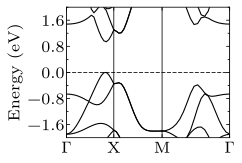
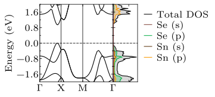
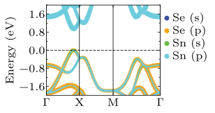

# Bands and DOS

For both BANDS and DOS you need first off all SCF converged CHGCAR file. After that you can follow these steps to get DOS and BANDs.

## DOS

* Use Tetragedra (`IMEAR=-5`) smearnig whenever you need to calculate DOS.
* Some times it happens that Bands and DOS do not properly allign. Most probably the `ISMEAR` is not -5.

## BANDS

* You can use vaspkit to generate KPATH.
* Do not use `ISMEAR=-5` in this case.

## PLOTTING

You can write your own program but the best option is to use `sumo`. Alibrary that makes the work so much easier. It can be installed as

```bash
pip install sumo
```

## Results

| Only Bands | Merged Band-DOS | Project BAND-DOS |
| :--: | :--: | :--: |
|  | | |
