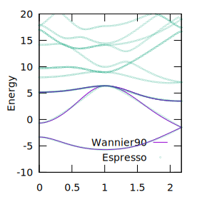
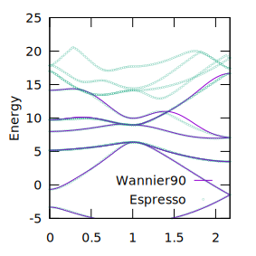
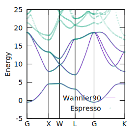

These tutorial files are part of EPW School 2021

## ex-01-Si-Valance Bands Only

## ex-02-Si-VB-CB both

## ex-03-Lead-Bands

## How to check if wannierization is converged
* https://youtu.be/Z2M_q8if1uU?t=2909

## Reference

* https://docs.epw-code.org/doc/School2021.html#
