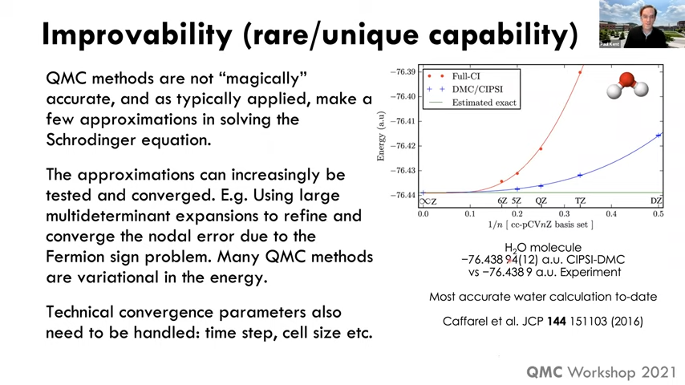

# QMCPACK

Quantum Monte Carlo

## Week-01

* https://youtu.be/CP2NV834VfQ

These methods have their own advantage and weakness, e.g.
|Method|Area|
|--:|:--|
|Tight Binding |Topological Materials and Twisted Graphene|
|GW |Excellent method for optical properties but not for atomic position|

## Week-02

## Week-04

## Take Aways

* Very Accurate.
* Accurately account for van der Waals.
* Full many body quatum wavefunction is calculated.
* Achieving error bar by 10X will cost 100x. So we mush consider the accuracy cutoff that is enough.
* Trial wavefunctions are taken from other quantum mechanical tools such as DFT.

## References
* https://github.com/QMCPACK/qmc_workshop_2021