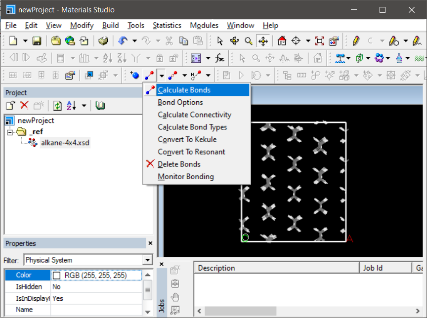

# Material Studio with LAMMPS

Some times we need some force field files that are shipped with materials studio package and export those file to use with lammps for exmaple `pcff`. To do this we have msi2lmp tool which is shipped with lammps distro and is compiled along with lammps. Material studio work best with `.cif` file so prepare the input file. We can use either vesta to export into cif format or we can also use `python-ase`. Once we have the cif file imported next step is to calculate and assign bonds. For organic molecule it works just fine. After we have defined bonds we can proceed to assign force field and charge to atoms. Procedure to assign force field and charge will be mentioned in details.

If bonds, charge and force field types are assigned correctly we can export this file (after saving...) in mdf,car format. which can be read by msi2lmp tool. to convert it to a form readable by lammps.

To use msi2lmp tool we also need force field parameter set file (.frc). some are shipeed with lammps alongside msi2lmp. A very nice referece to get external frc file is https://bionanostructures.com/interface-md/ which ships interface force field of metal and organic materils worth visiting.

A complete walkthrough will be provided here. We simulate the chain of organic Molecule ODPA but without PO3 group, i.e. a long alkane chain. these long alkane chain are attracted to each other by van der Walls forces and form something known as self assembling molecule(SAM). PO3 group might have more strong bonding with the substrate and thus acts as stablizer but we will not consider this instead we can fix the end sp3 carbon any way...we proceed.

We start with a new project and create a folder `_ref`. this folder should contain all the imported `.cif` file. Since we will not directly use these files instead a copy of these files so that even if we do something terrible we can always delete and copy again.
* Import [alkane-4x4.cif]("./data/alkane-4x4.cif") in this `_ref` folder inside material studio.

* Now unselect everything(double click in the black area) and click on calculate bond to calculate the bonds between carbon and hydrogen.

* You can change the view of the structure by right click in black region and adjust the `display style` and `label`. Display style `Ball and Stick` runs slow for long structure so better to stay with `line`. There are multiple options for `label` also. Label can be helpful in knowing if forcefield types or charges are assigned correctly or not. So we can change the label to `forceField` type and apply

* Now after unseleting everything(left click few times in the black area) we go to forcite tools.

* Now to energy tab and select appropriate forcefield (pcff here).

* Go to `more` just next to forcefield. and click on 1 and 2. Do not click the assign button(marked with blue cross) as this is supposed to be used if we want to assign the forcefield type manually.

* Save the progress and we can see now see the forcefield label on the atoms. this is ready to export to car fromat now.

* export finally. This will export two file with extension `.car` and `.mdf`. Both are necessary.

That is it we are done with the most frustrating part we can now use the msi2lmp tool and third party `.frc` files to convert them in lammps format.

the script to convert these files is provided in [data]("./data") folder along with all the input and output files.
