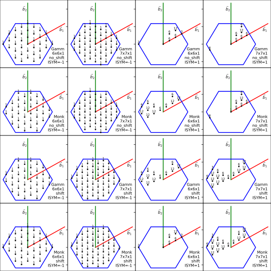
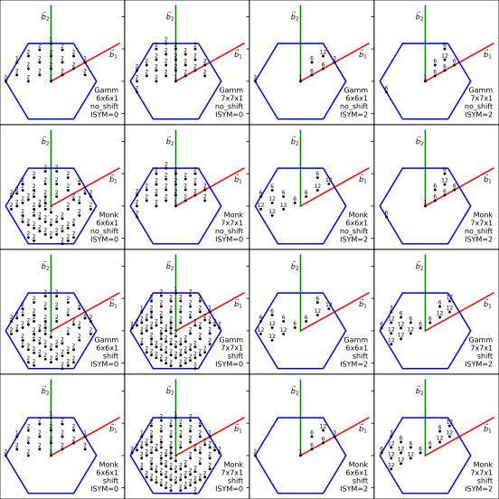

## k-Point Mesh Comparison

* The blue hexagonal region represents the first Brillouin zone.
* The vectors $\vec{b}_1$ and $\vec{b}_2 are the reciprocal in-plane lattice vectors, defined according to the standard reciprocal space construction.
* The plotted points correspond to the irreducible k-points, each annotated with their respective weights.

These weights indicate the contribution of each k-point to Brillouin zone integrations, accounting for the symmetry of the system.

---

---
