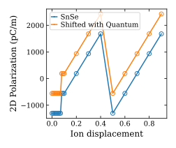
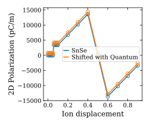

## ex-02
Atoms are shifted along the unit cell to check how the polarization change with different choice of origin of unit cell.

## Result

### Polarization along y with shift along y

### Polarization along z with shift along z

