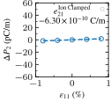
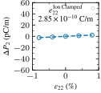

## Piezoelectric Tensor
Here we calculate $e_{ij}$ component of the piezoelectric trensor $\mathrm{e}$, i.e polarization along the $i$-direction in reponse to strain applied along the $j$-directoin.

### Manual Method
Berry Phase approach is used to calculate the polarization generally. But For calculating polarization along the non-periodic direction (z-axis) we do not need berry
phase approach as polarization can be uniquely defined by placing the slab in the middle along the z-direction and taking 0,0,0 as the reference. So the case of out
of plane polarization is presented in ex-020-NbN.

### Automatic Method
```
---From VASP Documentation---
The piezoelectric tensor can be computed by finite differences with respect to a finite electric field using LCALCEPS or by using DFPT with LEPSILON in combination with IBRION = 5,6 or 7,8.

--IBRION--
5: Finite differences without symmetry
6: Finite differences with symmetry
7: DFPT without symmetry
8: DFPT with symmetry.
```
So
* `LCALEPS` should be compatible with `IBRION=5,6`.
* `LEPSILON` should be compatible with `IBRION=7,8`.


## Rerference

* Giant piezoelectricity of monolayer group IV monochalcogenides: SnSe, SnS, GeSe, and GeS. Appl. Phys. Lett. 107, 173104 (2015); https://doi.org/10.1063/1.4934750
* https://chengcheng-xiao.github.io/post/2019/08/05/Berryphase_Ferroelectricity.html
* https://chengcheng-xiao.github.io

## ex-01-2SeSn-1
### Manual Method
|$e_{11}$|$e_{12}$|$e_{22}$|
|:--:|:--:|:--:|
||||

### DFPT Method

```
-------INCAR----------
IBRION  = 7 
LEPSILON = True
----------------------
Total Contr ((10^{-10}C/m))
------  ------  ------  ------  ------  ------
32.017   6.987   0.053   0.036  -0.000   0.001
-0.039  -0.055   0.010  31.326  -0.000  -0.000
 0.000   0.000  -0.000   0.000   0.002   0.015
------  ------  ------  ------  ------  ------
```
## ex-02-2B2O3-1
### Manual Method

|$e_{21}$|$e_{22}$|
|:--:|:--:|
|||

### DFPT Method
```
-------INCAR----------
IBRION  = 7 
LEPSILON = True
----------------------
Total Contr ((10^{-10}C/m))
------  ------  ------  ------  ------  ------
-0.003  -0.003  -0.000   0.006  -0.000   0.000
-0.178  -0.756  -0.025  -0.001   0.000   0.000
 0.000   0.000   0.000  -0.000   0.066  -0.000
------  ------  ------  ------  ------  ------
```

##  ex-03-6PbS-1
### Manual
|$e_{21}$|$e_{22}$|
|:--:|:--:|
|||

### DFPT
```
-------INCAR----------
IBRION  = 8 
LEPSILON = True
----------------------

Total Contr ((10^{-10}C/m))
------  ------  ------  ------  ------  ------
-0.013  -0.006   0.006  51.750   0.003  -0.003
14.646  35.102   0.105  -0.000   0.001   0.001
-0.001  -0.001  -0.001  -0.000  -0.019  -0.002
------  ------  ------  ------  ------  ------
```

## ex-04-2SeSn-1+6PbS-1 

This does contain vdW correction term.
### Manual
|$e_{21}$|$e_{22}$|
|:--:|:--:|
|||


## Finite Difference + LEPSILON

```
-------INCAR----------
IBRION  = 5 #  finite differences without symmetry
LEPSILON = True 
----------------------

PIEZOELECTRIC TENSOR (ION CLAMPED) ((10^{-10}C/m))
------  ------  ------  ------  -----  ------
-0.127  -0.032  -0.100  -7.020  0.004   1.333
-6.694   2.590   2.495   0.097  0.233  -0.001
 0.005  -0.018  -0.062   0.000  0.148  -0.002
------  ------  ------  ------  -----  ------
```