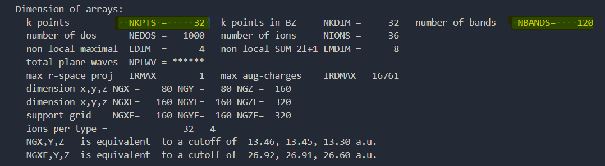

# Parallel Computing in VASP

The two most important parallelisation in vasp are

1. Band Parallelisation
2. K-Point Parallelisation

So even before thinking of parallisation we need to have in our hand how many

1. Bands are there in our system. i.e. (NBANDS)
2. How many irreducible K-POINTS. i.e. (NKPTS)

The exact values can be obtained from OUTCAR file after a [TestRun](~/00-Test-Run)



We have `32` irreducible K-Points and `120` Bands in this system.

It is advisable to have them in even numbers divisible by 2's. If 
default values of NBANDS do not work then it is better to specify
manually in the INCAR file. the number of k-POINTS can be slighly 
tuned by shifting the monkhrost pack scheme.

## Bands Parallelisation

This is the most expensive thing to calculate in VASP. 
Calculation of a *single* band can be distributed over many cores. 
It is almost always best to distribute the computation of single band 
over as many cores as available per node. 
For example if on high computing machine such as ibex we have 24 cores 
per node then we can distribute computation of a single band over
24 cores. i.e. `NCORE=24` . In this case 24 cores will work on computation 
of a single band.

So if we are only conserned with band parallelisation and do not want KPOINT
parallelisation then it is best to choose 

```
Total numbers of cores = N*Total no of bands
where N is some integer.
N = 1 almost always work on most cases

& set
NCORE = #cores-per-node
```

for example in the given case an efficient archetecture could be

```
# since NBANDS = 120
nodes = 5
cores-per-node=24

# In in INCAR
NCORE = 24
```

In my experiance I have observed that increasing cores-per-node futher only
minimally improves the parallisation. So 24 is a good choice 

## KPOINT Parallelisation

Once we have determined optimal setting for band parallisation we can move to
KPOINT parallelisaiton. We can specify how many KPOINTS should be evaluated 
side by side, bydefault in vasp we 1. This setting is controlled by `KPAR` . So
for example we have 32 KPOINTS then we have have possibility to treat either
2, 4, 8, 16, or 32 KPOINTS in parallel. But depending up no of cores that we
want to expense we can decide. Values around 4 to 8 work just fine. 

So with KPOINT Parallisation enabled out setting would be

```
# since NBANDS = 120, NKPTS=32 , We want to treat 4 KPTS in parallel
nodes = 5*4
cores-per-node=24

# In in INCAR
NCORE = 24
KPAR = 4
```
