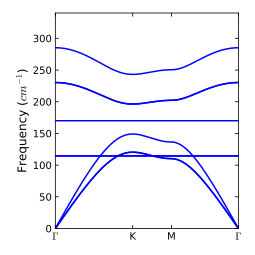
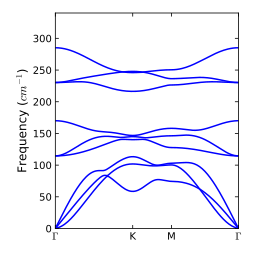
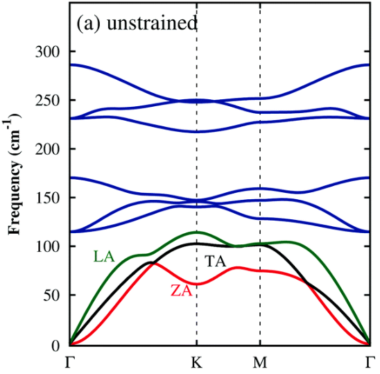

# Phonon modes using phonopy

## Setup Phonopy

`phonopy` is provided by conda-forge channel. You can install 
```
conda install -c conda-forge phonopy
```
or to install in a specific conda environment.
```
envName="basic"  # conda env name
conda install -n $envName -c conda-forge phonopy 
```

## How to run

```
bash run.sh  
# After all scf runs complete

cd ./calc
bash run-postprocess.sh > std-postporcess.out
```

## Results

### 1x1-cell Phonon Bands


### 4x4-cell Phonon Bands


### Reference Phonon Bands
Phonon bands as reported in https://doi.org/10.1039/C7CP06065C



## Other Reference to match phonon bands

* https://doi.org/10.1039/C5CP01649E
* https://doi.org/10.1039/C7CP06065C

## Refererences
* http://phonopy.github.io/phonopy/install.html
* https://rehnd.github.io/tutorials/vasp/phonons
