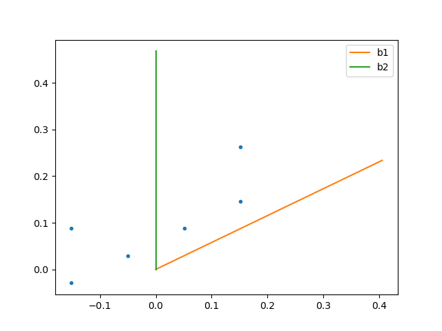
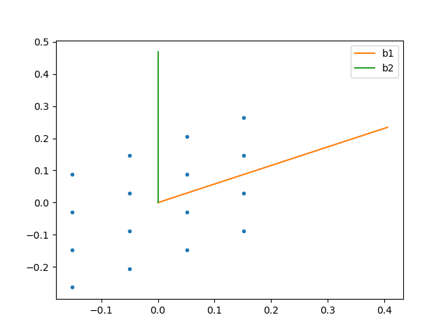
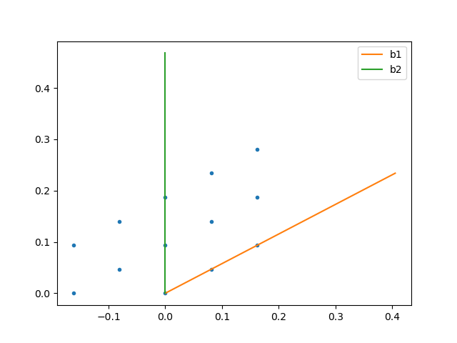
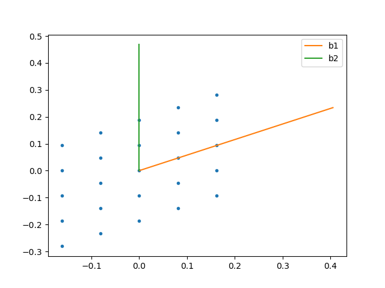
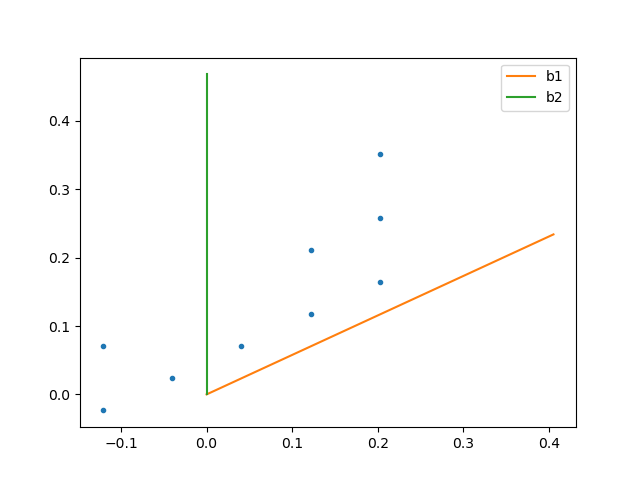
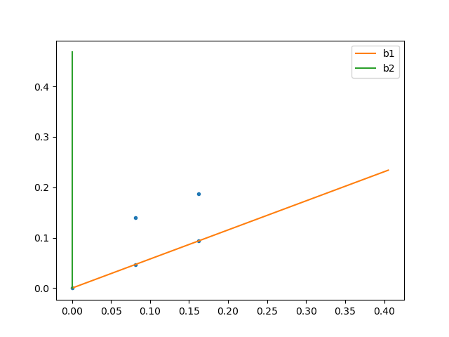

## k-mesh-4x4.png        
 

## k-mesh-4x4, ISYM= -1           
             

## k-mesh-4x4, ISYM= 2  
 

## k-mesh-4x4, shift= 0.5  
png  

## k-mesh-4x, ISYM= -1, shift= 0.5 
ift_0.5.png  

## k-mesh-5x5.png         
  

## k-mesh-5x5, ISYM0= 0      
     

## k-mesh-5x5, ISYM= -1  
  

## k-mesh-5x5, shift= 0.5

## k-mesh-5x5, shift= 1.0

