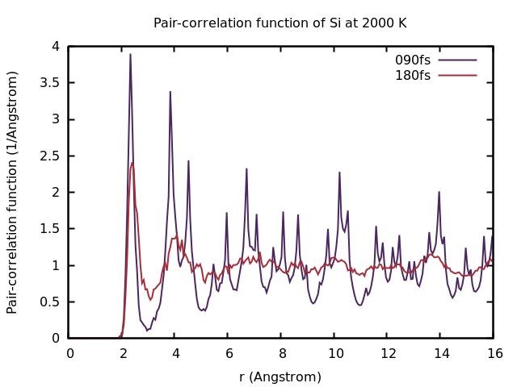
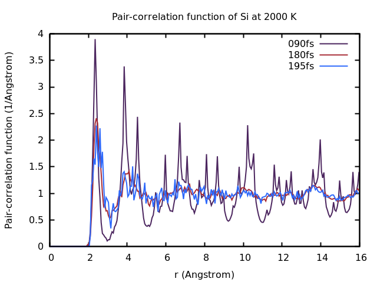

# ex-03-pair-correlation

We plot radial distributuin function from the simulations of [ex-01](./ex-01-Si-melting-090fs/) and [ex-02](./ex-02-Si-melting-180fs/). 

## Theory

The structure of a liquid can be studied using the [radial distribution function](https://en.wikipedia.org/wiki/Radial_distribution_function), also known as pair-correlation function. Roughly speaking, it is the probability of finding a particle at a given distance from the center of another particle. More precisely, it is the relative local particle density with respect to the average density of the system at a distance $r$ from the center of an arbitrarily chosen reference particle. 

See [Theory.ipynb](./README-theory.ipynb) for more.

## Calculation

The [pair-correlation function](https://en.wikipedia.org/wiki/Radial_distribution_function) is written to the [PCDAT](https://www.vasp.at/wiki/index.php/PCDAT) file. It can be visualized using **pair_correlation.sh**. 

In [ex-01-Si-melting](../ex-01-Si-melting-090fs/), you already simulated 90fs, so copy that [PCDAT](https://www.vasp.at/wiki/index.php/PCDAT) file to **PCDAT.090fs**! In [ex-02-Si-melting](../ex-02-Si-melting-180fs/) we restarted from the final structure of [ex-01](../ex-01-Si-melting-090fs/). Therefore, that [PCDAT](https://www.vasp.at/wiki/index.php/PCDAT) file corresponds to melting silicon after a total time of 180fs, but taking the ensemble average only over the simulation time of 90fs set by [NSW](https://www.vasp.at/wiki/index.php/NSW) and [POTIM](https://www.vasp.at/wiki/index.php/POTIM). Copy the [PCDAT](https://www.vasp.at/wiki/index.php/PCDAT) file to **PCDAT.180fs**! Then, plot the result and compare the pair-correlation functions!

Enter the following into the terminal:

```bash
bash grep-PCDAT.sh
bash pair-correlation.sh .090fs
bash pair-correlation.sh .180fs
bash pair-correlation.sh .195fs
gnuplot pair-correlation.gp
```

## Results



Why does the [pair-correlation function](https://en.wikipedia.org/wiki/Radial_distribution_function) at 90fs feature distinct peaks even beyond 4Å? 

<details>
<summary> Click to see the answer! </summary>

In the first 90 fs, the system is still close to its crystal structure. As a crystal has long-range order distinct peaks appear in the [pair-correlation function](https://en.wikipedia.org/wiki/Radial_distribution_function).

Also note that it makes no sense to display $g(r)$ for $r$ longer than half the shortest dimension of the supercell. That is, here $r$ should be kept below 5.4 Å.
    
</details>


What is the interpretation of the [pair-correlation function](https://en.wikipedia.org/wiki/Radial_distribution_function) at large distances? What is the interpretation at short distances? What is the characteristic shape of the [pair-correlation function](https://en.wikipedia.org/wiki/Radial_distribution_function) for liquids?



Does the new [PCDAT](https://www.vasp.at/wiki/index.php/PCDAT) correspond to sampling for 195fs or 15fs? How does this impact the quality of the [pair-correlation function](https://en.wikipedia.org/wiki/Radial_distribution_function)?**

<details>
<summary> Click to see the answer! </summary>

The pair-correlation function corresponds to sampeling the last 15fs of a total simulation time of 195fs, as you can see from the bad quality of the pair-correlation function.

</details>